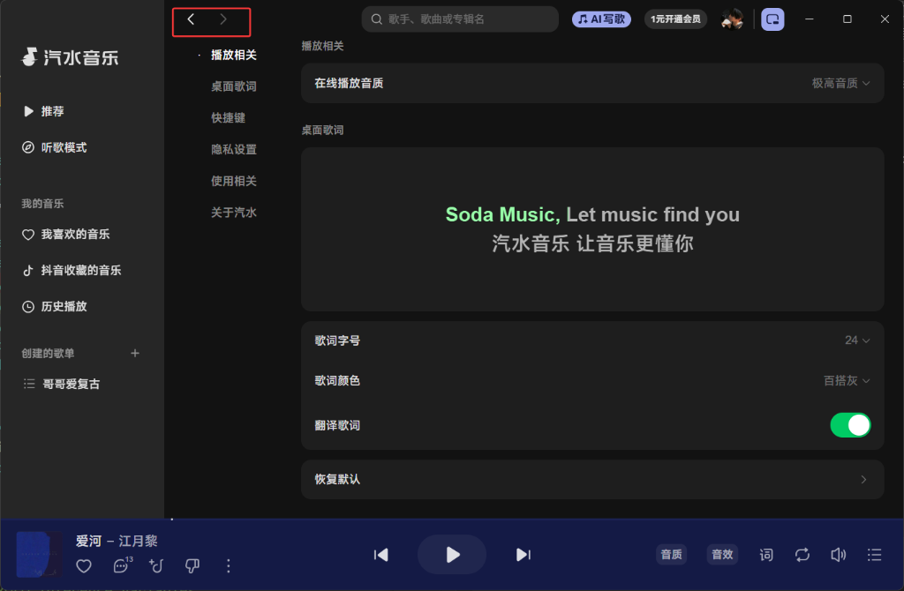

# Avatar 头像与头像菜单

`Avatar` 组件用于展示用户头像，支持图片和文字模式，支持圆形和方形。
此外，MonkeyQt 提供了 `MkAvatarMenu` 和 `ThemedAvatarMenu`，支持点击头像弹出下拉动作菜单，配合 `MkWindow` 可快速搭建现代化桌面的个人中心入口。

---

## 1. MkAvatar 基础头像

`MkAvatar` 继承自 `QLabel`，支持轻量级自适应展示。

### 基础用法

```python
from monkeyqt import MkAvatar

# 文字头像
avatar_txt = MkAvatar(text="MK")

# 图片头像
avatar_img = MkAvatar(image_path="path/to/photo.jpg")
```

### 属性与形状修改

```python
# 圆形（默认）
avatar_circle = MkAvatar(text="A", shape="circle", size=48)

# 方形（带微圆角）
avatar_square = MkAvatar(text="B", shape="square", size=48)

# 动态修改属性
avatar_circle.image_path = "path/to/new_photo.jpg"
avatar_circle.size = 64
```

---

## 2. MkAvatarMenu & ThemedAvatarMenu 头像菜单

`ThemedAvatarMenu` 继承自 `MkAvatarMenu`，为标题栏量身定做，具备**68种主题自适应渲染**、**下拉弹窗微圆角边缘裁剪**以及**边缘溢出自动校正对齐**等特性。

### 基础用法

```python
from monkeyqt import ThemedAvatarMenu

avatar_menu = ThemedAvatarMenu(
    text="落花",
    image_path="user_avatar.png",
    shape="circle",
    size=32,
    user_name="落花不写码",
    subtitle="PySide6 开发者",
    actions=[
        {"id": "profile", "text": "个人主页", "icon": "user"},
        {"id": "settings", "text": "账号设置", "icon": "gear"},
        {"id": "logout", "text": "退出登录", "icon": "sign-out", "separator_before": True},
    ]
)

# 监听菜单动作触发信号
avatar_menu.actionTriggered.connect(self._on_avatar_action)
```

---

## 3. 如何定义与定制个人中心页面

在现代化桌面应用中，通常点击头像弹窗中的“个人主页”会跳转至内容区的对应页面。在 MonkeyQt 中，推荐使用 `QStackedWidget` 结合信号槽来进行页面切换。

以下提供三种不同场景的个人中心页面实现模板，您可以直接复制并应用到您的项目中：

=== "场景 1：极客 / 开发者个人主页"

    适合开源项目、开发者个人面板。包含个人介绍、统计数据卡片与最近项目网格：

    

    ```python
    import os
    from PySide6.QtWidgets import QWidget, QVBoxLayout, QHBoxLayout, QLabel, QFrame, QGridLayout
    from PySide6.QtCore import Qt
    from monkeyqt import MkAvatar
    from monkeyqt.core.icons import MkPhosphorIcon

    class DeveloperProfileWidget(QWidget):
        def __init__(self, parent=None):
            super().__init__(parent)
            self._init_ui()

        def _init_ui(self):
            layout = QVBoxLayout(self)
            layout.setContentsMargins(30, 20, 30, 30)
            layout.setSpacing(20)

            # 1. 头部卡片
            user_card = QWidget()
            user_layout = QHBoxLayout(user_card)
            user_layout.setContentsMargins(0, 0, 0, 0)
            user_layout.setSpacing(20)

            avatar_path = os.path.join(os.path.dirname(__file__), "user_avatar.png")
            large_avatar = MkAvatar(
                text="落花",
                image_path=avatar_path if os.path.exists(avatar_path) else "",
                size=80,
                shape="circle",
            )
            user_layout.addWidget(large_avatar)

            info_widget = QWidget()
            info_layout = QVBoxLayout(info_widget)
            info_layout.setContentsMargins(0, 0, 0, 0)
            info_layout.setSpacing(6)

            name_lbl = QLabel("落花不写码")
            name_lbl.setStyleSheet("font-size: 22px; font-weight: bold;")
            meta_lbl = QLabel("42 个项目    1.2K Star    68 种主题")
            meta_lbl.setStyleSheet("font-size: 12px; color: #8e8e8e;")
            bio_lbl = QLabel("PySide6 / MonkeyQt 组件开发者 · 学习新思想")
            bio_lbl.setStyleSheet("font-size: 13px; color: #666666;")

            tags_layout = QHBoxLayout()
            tags_layout.setSpacing(8)
            tags_layout.setContentsMargins(0, 0, 0, 0)
            tag_loc = QLabel("📍 广西 · 南宁")
            tag_loc.setStyleSheet("color: #5b8ff9; background-color: rgba(91,143,249,0.1); padding: 3px 10px; border-radius: 4px; font-size: 11px;")
            tag_sch = QLabel("🎓 吗喽大学")
            tag_sch.setStyleSheet("color: #61c454; background-color: rgba(97,196,84,0.1); padding: 3px 10px; border-radius: 4px; font-size: 11px;")
            tags_layout.addWidget(tag_loc)
            tags_layout.addWidget(tag_sch)
            tags_layout.addStretch()

            info_layout.addWidget(name_lbl)
            info_layout.addWidget(meta_lbl)
            info_layout.addWidget(bio_lbl)
            info_layout.addLayout(tags_layout)
            user_layout.addWidget(info_widget, stretch=1)
            layout.addWidget(user_card)

            # 2. 统计卡片行
            stats_layout = QHBoxLayout()
            stats_layout.setSpacing(16)
            stats_data = [
                ("🔧", "组件数量", "36 个", "#409EFF"),
                ("🎨", "主题风格", "68 种", "#67C23A"),
                ("⭐", "GitHub Star", "1,247", "#E6A23C"),
            ]
            for emoji, title, value, color in stats_data:
                card = QFrame()
                card.setStyleSheet(f"QFrame {{ background: white; border: 1px solid #e8e8e8; border-radius: 8px; border-left: 3px solid {color}; }}")
                card_layout = QVBoxLayout(card)
                card_layout.setContentsMargins(16, 12, 16, 12)
                h = QLabel(f"{emoji}  {title}")
                h.setStyleSheet("font-size: 12px; color: #999999;")
                v = QLabel(value)
                v.setStyleSheet(f"font-size: 20px; font-weight: bold; color: {color};")
                card_layout.addWidget(h)
                card_layout.addWidget(v)
                stats_layout.addWidget(card)
            layout.addLayout(stats_layout)

            # 3. 项目展示
            proj_title = QLabel("最近项目")
            proj_title.setStyleSheet("font-size: 16px; font-weight: bold;")
            layout.addWidget(proj_title)

            grid = QGridLayout()
            grid.setSpacing(14)
            projects = [
                ("MonkeyQt 组件库", "PySide6 现代化 UI 组件", "chart-bar", "#409EFF"),
                ("YOLO 目标检测", "基于 YOLOv8 的检测系统", "eye", "#67C23A"),
            ]
            for idx, (title, desc, icon, color) in enumerate(projects):
                card = QFrame()
                card.setStyleSheet(f"QFrame {{ background: white; border: 1px solid #e8e8e8; border-radius: 8px; }} QFrame:hover {{ border-color: {color}; }}")
                card_layout = QVBoxLayout(card)
                card_layout.setContentsMargins(16, 16, 16, 16)
                icon_lbl = QLabel()
                icon_lbl.setPixmap(MkPhosphorIcon.get_pixmap(icon, color, 28))
                t_lbl = QLabel(title)
                t_lbl.setStyleSheet(f"font-size: 14px; font-weight: bold; color: {color};")
                d_lbl = QLabel(desc)
                d_lbl.setStyleSheet("font-size: 12px; color: #999999;")
                card_layout.addWidget(icon_lbl)
                card_layout.addWidget(t_lbl)
                card_layout.addWidget(d_lbl)
                card_layout.addStretch()
                grid.addWidget(card, 0, idx)
            layout.addLayout(grid)
            layout.addStretch()
    ```

=== "场景 2：社交 / 媒体化个人中心"

    适合社交应用、音乐播放器、博客等。包含顶部渐变背景横幅、关注者统计以及最近动态列表：

    ```python
    from PySide6.QtWidgets import QWidget, QVBoxLayout, QHBoxLayout, QLabel, QFrame, QListWidget, QListWidgetItem
    from PySide6.QtCore import Qt
    from PySide6.QtGui import QLinearGradient, QPalette, QBrush
    from monkeyqt import MkAvatar

    class SocialProfileWidget(QWidget):
        def __init__(self, parent=None):
            super().__init__(parent)
            self._init_ui()

        def _init_ui(self):
            layout = QVBoxLayout(self)
            layout.setContentsMargins(0, 0, 0, 0)
            layout.setSpacing(0)

            # 1. 顶部色彩斑斓的 Banner 背景板
            banner = QFrame()
            banner.setFixedHeight(120)
            banner.setStyleSheet("background: qlineargradient(x1:0, y1:0, x2:1, y2:1, stop:0 #ff7e5f, stop:1 #feb47b); border: none; border-radius: 0px;")
            layout.addWidget(banner)

            # 2. 悬浮个人卡片（头像、关注数等）
            info_area = QWidget()
            info_layout = QVBoxLayout(info_area)
            info_layout.setContentsMargins(30, -30, 30, 20) # 负边距让头像悬浮在横幅上
            info_layout.setSpacing(10)

            avatar_row = QHBoxLayout()
            large_avatar = MkAvatar(text="猫咪", size=72, shape="circle")
            large_avatar.setStyleSheet("border: 3px solid white;")
            avatar_row.addWidget(large_avatar)
            avatar_row.addStretch()
            
            # 关注按钮等可以加在这里
            info_layout.addLayout(avatar_row)

            name_lbl = QLabel("神秘的音乐家")
            name_lbl.setStyleSheet("font-size: 20px; font-weight: bold;")
            bio_lbl = QLabel("记录每一份生活，音乐让寻找变得简单。")
            bio_lbl.setStyleSheet("color: #777777; font-size: 13px;")
            
            stats_row = QHBoxLayout()
            stats_row.setSpacing(20)
            for num, label_txt in [("12.5K", "关注者"), ("348", "关注中"), ("89", "动态")]:
                item = QLabel(f"<b>{num}</b> {label_txt}")
                item.setStyleSheet("font-size: 13px; color: #444444;")
                stats_row.addWidget(item)
            stats_row.addStretch()

            info_layout.addWidget(name_lbl)
            info_layout.addWidget(bio_lbl)
            info_layout.addLayout(stats_row)
            layout.addWidget(info_area)

            # 3. 动态列表区
            feed_title = QLabel(" 最近动态")
            feed_title.setStyleSheet("font-size: 15px; font-weight: bold; margin: 10px 30px;")
            layout.addWidget(feed_title)

            feed_list = QListWidget()
            feed_list.setFrameShape(QFrame.NoFrame)
            feed_list.setStyleSheet("QListWidget { background: transparent; padding: 0 30px; } QListWidget::item { padding: 12px 0; border-bottom: 1px solid #eeeeee; }")
            
            feeds = [
                "🎵 收藏了歌单《夜跑专属电音合集》",
                "📝 发布了新日记《在南宁夏日街头看落日》",
                "🎨 更新了个人封面背景",
            ]
            for feed in feeds:
                QListWidgetItem(feed, feed_list)

            layout.addWidget(feed_list, stretch=1)
    ```

=== "场景 3：企业 / 管理员账号控制台"

    适合企业级系统。包含详细资料展示和最近登录日志：

    ```python
    from PySide6.QtWidgets import QWidget, QVBoxLayout, QHBoxLayout, QLabel, QFrame, QFormLayout
    from monkeyqt import MkAvatar, MkButton

    class AdminConsoleWidget(QWidget):
        def __init__(self, parent=None):
            super().__init__(parent)
            self._init_ui()

        def _init_ui(self):
            layout = QVBoxLayout(self)
            layout.setContentsMargins(30, 20, 30, 30)
            layout.setSpacing(20)

            title = QLabel("管理员账号信息")
            title.setStyleSheet("font-size: 20px; font-weight: bold;")
            layout.addWidget(title)

            # 详情面板
            details_frame = QFrame()
            details_frame.setStyleSheet("QFrame { background: white; border: 1px solid #e8e8e8; border-radius: 8px; }")
            frame_layout = QHBoxLayout(details_frame)
            frame_layout.setContentsMargins(20, 20, 20, 20)
            frame_layout.setSpacing(30)

            avatar_col = QVBoxLayout()
            avatar_col.addWidget(MkAvatar(text="Admin", size=90, shape="square"))
            avatar_col.addSpacing(10)
            avatar_col.addWidget(MkButton("更改头像", type="primary", size="small"))
            avatar_col.addStretch()
            frame_layout.addLayout(avatar_col)

            form = QFormLayout()
            form.setVerticalSpacing(14)
            form.setHorizontalSpacing(20)
            form.addRow("用户账号：", QLabel("admin_monkey"))
            form.addRow("管理角色：", QLabel("超级系统管理员"))
            form.addRow("所属部门：", QLabel("核心组件开发部"))
            form.addRow("邮箱地址：", QLabel("admin@monkeyqt.com"))
            form.addRow("上次登录：", QLabel("2026-06-16 11:20 (广西·南宁)"))
            frame_layout.addLayout(form, stretch=1)

            layout.addWidget(details_frame)
            
            # 安全快速操作
            quick_layout = QHBoxLayout()
            quick_layout.setSpacing(12)
            quick_layout.addWidget(MkButton("修改密码", type="warning"))
            quick_layout.addWidget(MkButton("多因子验证 (MFA)", type="success"))
            quick_layout.addWidget(MkButton("安全注销", type="danger"))
            quick_layout.addStretch()
            layout.addLayout(quick_layout)
            
            layout.addStretch()
    ```

---

## 4. API 参考

### MkAvatar (基础头像)

| 属性/方法 | 类型 | 说明 |
| :--- | :--- | :--- |
| `text` | `str` | 获取/设置文字内容（自动提取前两个字符并转大写） |
| `image_path` | `str` | 获取/设置本地图片路径 |
| `shape` | `str` | 获取/设置形状，可选值为 `"circle"`（圆形）或 `"square"`（微圆角矩形） |
| `size` | `int` | 获取/设置头像显示尺寸（宽高像素） |

### ThemedAvatarMenu (头像下拉菜单)

| 属性/方法/信号 | 类型 | 说明 |
| :--- | :--- | :--- |
| `user_name` | `str` | 菜单头部展示的用户名 |
| `subtitle` | `str` | 菜单头部展示的子标题 |
| `set_actions(actions)` | `list[dict]` | 重设下拉列表项。如 `[{"id": "set", "text": "设置", "icon": "gear"}]` |
| `actionTriggered(action_id)` | `Signal(str)` | **信号**。当点击菜单中的某一项时触发，携带所点击动作项的 `id` 参数 |
